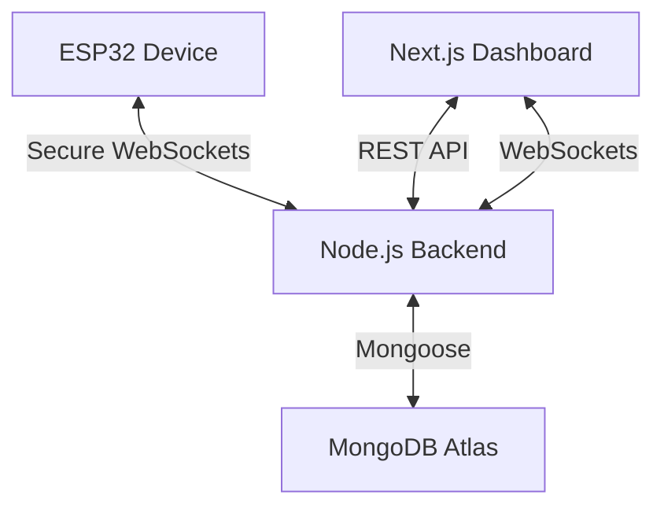

# 🌐 IoT Device Control Platform

A professional, full-stack IoT solution for controlling AC appliances (lamps, fans, etc.) remotely using an ESP32, Node.js, and Next.js. 

---

## 🏗️ Architecture



### 🛠️ Tech Stack

| Component | Technology |
| :--- | :--- |
| **Firmware** | C++, PlatformIO, ArduinoJson, ESP32 |
| **Backend** | Node.js, Express, MongoDB (Mongoose), ws (WebSockets) |
| **Frontend** | Next.js, TailwindCSS, Zustand, Framer Motion |
| **Deployment** | Render (Backend/Frontend), MongoDB Atlas |

---

## ✨ Features

- **Real-time Control**: Toggle AC appliances with <100ms latency.
- **State Synchronization**: Automatic state recovery after power failure/reset.
- **Secure Auth**: Device-level token authentication for hardware.
- **Presence Monitoring**: Real-time "Online/Offline" status tracking for all devices.
- **Command History**: Blockchain-inspired transaction logging for state changes.
- **Modern Dashboard**: Responsive, dark-mode-first control center.

---

## 🔌 Hardware Setup

### Components Needed
- **ESP32 DevKit V1**
- **SRD-05VDC-SL-C Relay Module**
- **AC Light Bulb & Holder**
- **Jumper Wires**

### Wiring Diagram
| Relay Pin | ESP32 Pin | Logic |
| :--- | :--- | :--- |
| **VCC (+)** | **Vin (5V)** | Power for Coil |
| **GND (-)** | **GND** | Common Ground |
| **Signal (S)** | **GPIO 2** | Control Signal |

> [!WARNING]
> **AC Mains voltage is FATAL.** 
> Use the **Normally Open (NO)** and **Common (COM)** terminals of the relay to interrupt the **Live line** of your AC cord. Ensure no bare wires are exposed.

---

## 🚀 Getting Started

### 1. Backend Setup
1. Clone the repository.
2. Initialize environment variables: `cp .env.example .env`.
3. Fill in your `MONGODB_URI` and `JWT_SECRET`.
4. Run the development server:
   ```bash
   npm install
   npm run server
   ```

### 2. Frontend Setup
1. Navigate to `frontend/`.
2. Install dependencies: `pnpm install`.
3. Set `NEXT_PUBLIC_API_URL` to your backend URL.
4. Start the dashboard: `pnpm dev`.

### 3. Firmware Setup
1. Open the `firmware/` folder in VS Code with **PlatformIO**.
2. Update `platformio.ini` with your credentials:
   ```ini
   build_flags = 
       -DWIFI_SSID='"Your_SSID"'
       -DWIFI_PASSWORD='"Your_Password"'
       -DBACKEND_URL='"your-app.onrender.com"'
       -DDEVICE_TOKEN='"your-unique-token"'
   ```
3. Click **Upload** to flash the ESP32.

---

## 🔐 API Reference (WebSockets)

Devices connect to `wss://your-backend.com/ws` with a Bearer token.

| Message Type | Direction | Description |
| :--- | :--- | :--- |
| `heartbeat` | Device -> Server | Periodic keep-alive |
| `command` | Server -> Device | Turn ON/OFF trigger |
| `state_report` | Device -> Server | Confirming current relay state |
| `welcome` | Server -> Device | Initial handshake & state sync |

---

## 📄 License
Distributed under the MIT License. See `LICENSE` for more information.
